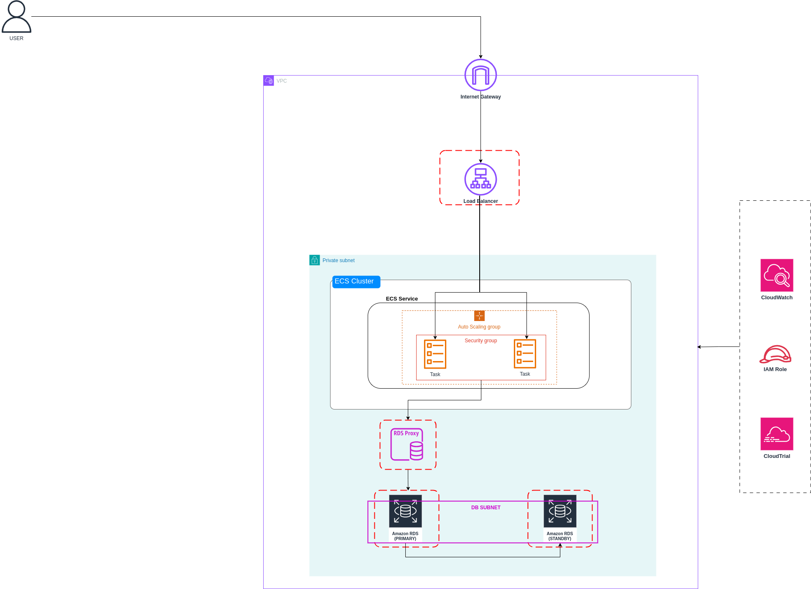

# Containerized LAMP Application

## Table of Contents

- [Project Overview](#project-overview)
- [Architecture](#architecture)
- [Infrastructure Components](#infrastructure-components)
    - [Networking](#networking)
    - [Security Groups](#security-groups)
    - [Database](#database)
    - [Container Infrastructure](#container-infrastructure)
    - [Load Balancing](#load-balancing)
- [Application Configuration](#application-configuration)
    - [Docker Container](#docker-container)
    - [Database Connection](#database-connection)
- [Deployment Process](#deployment-process)
    - [Prerequisites](#prerequisites)
    - [Deployment Steps](#deployment-steps)
- [Maintenance and Operations](#maintenance-and-operations)
    - [Updating the Application](#updating-the-application)

---

## Project Overview

This project implements a containerized LAMP (Linux, Apache, MySQL, PHP) stack deployed on **AWS Elastic Container Service (ECS)** using the **Fargate** launch type. The application is a PHP-based CRUD application with a MySQL database backend hosted on **Amazon RDS**, designed for high availability and scalability.

The infrastructure is provisioned using **AWS CloudFormation**, ensuring a robust and repeatable deployment process that can be version-controlled. The architecture includes:

- A multi-AZ setup with public and private subnets.
- An **Application Load Balancer (ALB)** for traffic distribution.
- A highly available **MySQL RDS instance**.

---

## Architecture



The architecture consists of:

- **Network Layer**: Custom VPC with three public subnets and two private subnets across multiple Availability Zones.
- **Compute Layer**: ECS Fargate for running Docker containers without managing EC2 instances.
- **Database Layer**: Multi-AZ MySQL RDS instance deployed in private subnets.
- **Load Balancing**: ALB distributing traffic to ECS tasks.
- **Security**: Dedicated security groups for each component, following the principle of least privilege.

---

## Infrastructure Components

### Networking

- **Custom VPC** (CIDR: `192.168.0.0/16`)
- **3 Public Subnets** for ALB
- **2 Private Subnets** for ECS and RDS
- **Internet Gateway** for outbound traffic from public subnets
- **Route Tables** for controlled traffic flow

### Security Groups

- **Load Balancer Security Group**: Allows HTTP (port 80) traffic from the internet.
- **Container Security Group**: Allows traffic only from ALB.
- **RDS Security Group**: Allows MySQL (port 3306) traffic only from containers.

### Database

- **Amazon RDS (MySQL)**: `db.t3.micro` with 20GB storage.
- **Multi-AZ Deployment** for high availability.
- Credentials securely stored in **AWS Secrets Manager**.

### Container Infrastructure

- **ECS Cluster (Fargate)**: Named `MyCluster`.
- **Task Definition**: 1 vCPU, 3GB Memory.
- **Custom PHP 8.2 Apache Image** stored in **Amazon ECR**.
- **Health Checks** for service availability.

### Load Balancing

- **Application Load Balancer (ALB)**:
    - Deploys across two private subnets.
    - Distributes traffic to healthy ECS tasks.

---

## Application Configuration

### Docker Container

- Custom Docker image built on **PHP 8.2 with Apache**.
- Contains all necessary PHP extensions for MySQL connectivity.
- Links: [Dockerfile](./Dockerfile) | [Startup Script](./startup.sh)

### Database Connection

Environment variables passed securely from **AWS Secrets Manager**:

- `DB_USERNAME`
- `DB_PASSWORD`
- `DB_NAME`
- `DB_HOST` (RDS Proxy endpoint)

---

## Deployment Process

### Prerequisites

- AWS account with appropriate permissions.
- AWS CLI configured.
- Docker image built and pushed to **ECR**.

### Deployment Steps

1. **Prepare Parameters**:
     - `ClusterName`, `ServiceName`, `TaskDefinitionFamily`
     - `Image` (ECR URI), `TaskRoleArn`
     - Database credentials (`DBUsername`, `DBPassword`, `DBName`)

2. **Deploy CloudFormation Stack**:

     ```bash
     aws cloudformation create-stack \
         --stack-name lamp-application \
         --template-body file://lamp-stack.yaml \
         --parameters ParameterKey=ClusterName,ParameterValue=<your-cluster-name> \
             ParameterKey=ServiceName,ParameterValue=<your-service-name> \
             ParameterKey=TaskDefinitionFamily,ParameterValue=<your-task-definition-name> \
             ParameterKey=TaskRoleArn,ParameterValue=<your-task-role-arn> \
             ParameterKey=Image,ParameterValue=<your-ecr-image-uri> \
             ParameterKey=DBUsername,ParameterValue=<username> \
             ParameterKey=DBPassword,ParameterValue=<password> \
             ParameterKey=DBName,ParameterValue=<dbname> \
         --capabilities CAPABILITY_IAM
     ```

     > **Note**: Ensure task and execution roles have necessary permissions.

3. **Monitor Deployment**:

     ```bash
     aws cloudformation describe-stacks --stack-name lamp-application
     ```

---

## Maintenance and Operations

### Updating the Application

1. Build and push a new Docker image to **ECR**.
2. Update the ECS service with the new image:

     ```bash
     aws ecs update-service --cluster <cluster-name> --service <service-name> --force-new-deployment
     ```
